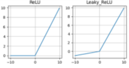

# Função de Ativação, o Núcleo da Composição de Neurônios Artificiais

# INTRODUÇÃO

As redes neurais artificiais – RNAs (artificial neural networks – ANN)
são algoritmos poderosos, muito utilizados em aplicações de inteligência
artificial (IA) e aprendizado de máquina (machine learning – ML).  

As RNAs são capazes de “aprender” uma determinada função ou
reconhecimento de padrões, despertando interesse em diversas áreas do
conhecimento humano, de medicina diagnóstica a robótica, automação e
controle de sistemas complexos{A. de Carvalho Junior (2021)}. 

As RNAs são constituídas de neurônios artificiais cujas funções
matemáticas são inspiradas em neurônios biológicos, constituindo a base
de redes neurais artificiais. A
<a href="#fig-imagem1" class="quarto-xref">Figure 1</a> apresenta um
exemplo de interligação de neurônios para compor uma RNA. 

Apesar de não ter a mesma complexidade de um cérebro, as RNAs apresentam
duas similaridades básicas com as redes neurais biológicas Demuth et al.
(2014): 

1.  possibilidade de descrição de seus blocos de construção por
    dispositivos computacionais simples; 

2.  as conexões entre os neurônios determinam a função da rede. 

A <a href="#fig-figure2" class="quarto-xref">Figure 2</a> apresenta uma
representação de um neurônio biológico. Já a
<a href="#fig-figure3" class="quarto-xref">Figure 3</a> apresenta um
neurônio artificial de múltiplas entradas.

 

No neurônio biológico, os dentritos são filamentos responsáveis por
receber os sinais de informações para as células. O corpo celular, ou
soma, reúne as informações recebidas pelos dentritos. Já o axônio
transporta os impulsos elétricos que partem do corpo celular até as
diversas ramificações com dilatações bulbosas conhecidas como terminais
axônicos (ou terminais nervosos), que estabelecem as conexões sinápticas
com outras células A. de Carvalho Junior (2021). 

Conforme a <a href="#fig-figure3" class="quarto-xref">Figure 3</a>, o
neurônio artificial consiste de 2 etapas. A primeira é a somatória
ponderada dos sinais de entrada, que em seguida são aplicados a uma
função de ativação. Os pesos (w) representam a força das sinapses e são
multiplicados aos valores das respectivas entradas e somados, juntamente
com um valor de ajuste ou bias (b). O resultado desta soma (n) é então
aplicado a uma função de ativação (f) e apresentado na saída (a) do
neurônio artificial. Um neurônio artificial pode ser descrito como: 
$$
n = W_{1,1}P_1 + W_{1,2}P_2+ W_{1,3}P_3++ W_{1,R}P_R
$$ $$
a = f(Wp + b)
$$ As funções de ativação são um elemento fundamental das RNAs. Elas
essencialmente decidem se um neurônio deve ser ativado ou não. Em outras
palavras, se o que o neurônio está recebendo é relevante para a
informação fornecida ou deve ser desprezada Book (n.d.).  

Várias funções f podem ser utilizadas, mas é importante que a função de
ativação adotada seja derivável, de modo a permitir a elaboração de
algoritmos de regressão para calibração, ou “aprendizado”, dos pesos e
bias do neurônio Demuth et al. (2014). Pode ser demonstrado que se a
função de ativação for não linear, uma RNA de duas camadas pode ser um
aproximador universal de função Sonoda and Murata (2017).

# FUNÇÕES DE ATIVAÇÃO

As Figuras 4 e 5 apresentam algumas das funções de ativação mais
utilizadas em projetos de RNAs Apicella et al. (2021).  

## Função Step

A função de ativação mais elementar é a Função Degrau (Step), onde o
classificador é baseado em um limiar de ativação (threshold). Ela foi
utilizada nos primeiros neurônios artificiais foi introduzido em 1943
por W. McCulloch e W. Pitts segundo Demuth et al. (2014). $$
f(n)=1,n≥0
$$ $$
f(n)=0,n<0
$$ $$
f ^′(n)=0
$$ A função Step é mais teórica do que prática, pois em geral há mais de
uma classe de dados para serem classificados. Além disso, o gradiente da
função Step é zero, dificultando processos de aprendizagem da RNA. 
 

## Função Linear ou Identidade

A função identidade também é uma função simples, cuja derivada resulta
em uma constante (α), não importa o valor da entrada x. Isso dificulta
os processos de aprendizagem da RNA. Todavia a função linear pode ser
ideal para tarefas simples, onde a interpretabilidade é altamente
desejada \[4\], como por exemplo o neurônio da camada de saída da RNA.
$$
f(n) = an
$$ $$
f^′(n) = a
$$

## Função Sigmoide

Uma das funções de ativação mais utilizadas nas RNAs é a log-sigmoide,
por ser não linear e pela facilidade de implementação de sua derivada no
processo ajuste dos pesos, conforme as equações a seguir A. de Carvalho
Junior (2021), Apicella et al. (2021). $$
f(n) = \sigma(n) = \frac{1}{1 + e^{-n}}
$$ $$
f^′(n) = \sigma(n)(1 - \sigma(n))
$$

A função varia de 0 a 1 tendo um formato S. A função sigmoide
essencialmente tenta empurrar os valores de Y para os extremos. Esta é
uma qualidade muito desejável quando se deseja classificar os valores
para uma classe específica. A função sigmoide é amplamente utilizada.
Entretanto, quando os gradientes se tornam muito pequenos, a função se
aproxima de zero, dificultando o aprendizado do neurônio. Sua derivada
tende a 0 para valores de entrada maiores que +5 e abaixo de -5. Pelos
valores de saída estarem limitados a (0,1), pode exigir algum tipo de
normalização dos sinais de entrada para que sejam sempre positivos. Além
disso, em geral, uma RNA composta por sigmoide utiliza mais ciclos de
aprendizado do que RNAs com funções de ativação mais “rápidas” A. de
Carvalho Junior (2021),Book (n.d.).

## Função Tangente Hiperbólica (tanh)

A tanh é outra função do tipo sigmoide. Na verdade, é apenas uma versão
escalonada da função sigmóide., variando entre -1 e +1, cuja expressão e
derivada são dadas pelas equações a seguir: $$
f(n) = a = \tanh(n) =  \frac{e^n - e^{-n}}{e^n + e^{-n}}
$$

$$
f^′(n) = \tanh^′(n) = 1 - \tanh^2(n)
$$

A tanh funciona de forma semelhante à função sigmóide, mas é simétrica
em relação à origem, variando entre (-1,1). Ela Basicamente, soluciona o
problema dos valores, sendo todos do mesmo sinal. Todas as outras
propriedades são as mesmas da função sigmoide. É contínua e
diferenciável em todos os pontos. A função não é linear, resultando em
algoritmos de treinamento ligeiramente mais rápidos que a log-sigmoide
A. de Carvalho Junior (2021), Book (n.d.).

## Funções Baseadas em Retificadores

A função ReLU é a unidade linear retificada (retified linear unit –
ReLU). A função ReLU é muito parecida com a função identidade, fazendo
com o processo de aprendizagem da RNA, baseado nessa função de ativação,
seja muito mais rápido que por sigmoides Liu et al. (2019).

$$
f(n) = a  = LReLU(n) = \begin{cases}
n & \text{if } n \geq 0 \\
0 & \text{if } n < 0
\end{cases}
$$

$$
f^′(n) = ReLU^′(n) = \begin{cases}
1 & \text{if } n \geq 0 \\
0 & \text{if } n < 0
\end{cases}
$$

A ReLU é uma das funções de ativação mais utilizadas atualmente. A
principal vantagem de usar a função ReLU é que ela não ativa todos os
neurônios ao mesmo tempo. Na função ReLU, se a entrada for negativa, ela
será convertida em zero e o neurônio não será ativado. Isso significa
que, ao mesmo tempo, apenas alguns neurônios são ativados, tornando a
rede esparsa, eficiente e de computação fácil. Essa vantagem também pode
ser considerada uma desvantagem, pois os neurônios utilizando ReLU
tendem a “morrer” durante o treinamento, causando a saída do neurônio
iniciar a produzir apenas zeros. Uma variação da ReLU, chamada
Leaky-ReLU (LReLU) evita isso Liu et al. (2019) cuja função e sua
derivada são apresentadas pelas equações a seguir:

$$
f(n) = a  = LReLU(n) = \begin{cases}
an & \text{if } n \geq 0 \\
0 & \text{if } n < 0
\end{cases}
$$

$$
f^′(n) = ReLU^′(n) = \begin{cases}
a & \text{if } n \geq 0 \\
0 & \text{if } n < 0
\end{cases}
$$

Onde $α$ é um parâmetro introduzido na LReLU, com valores propostos
entre 0.01 e 0.2 Liu et al. (2019). A LReLU permite o neurônio ter um
pequeno gradiente quando ele não está ativo (n \< 0), reduzindo o
problema potencial mencionado sobre ReLU Apicella et al. (2021).

## Neurônio PAL2v

O neurônio PAL2v utiliza o algoritmo da lógica paraconsistente anotada
com anotação de 2 valores (paraconsistent annotated logic by 2-value
annotations – PAL2v), também chamada de lógica paraconsistente anotada
evidencial (paraconsistent annotated evidential logic – PAL ετ) \[1\]. A
PAL2v é uma variação da lógica paraconsistente, proposta pelo matemático
brasileiro Newton da Costa \[1\].

O neurônio PAL2v, quando entradas ponderadas por peso são combinadas e
aplicadas à função de ativação PAL2v foi proposto em A. de Carvalho
Junior (2021) e aplicado com sucesso na identificação e controle de
sistemas dinâmicos não lineares Carvalho et al. (2021) ,A. de Carvalho
Junior et al. (2023). Ao contrário das funções de ativação que possuem
uma entrada (n) e uma saída (a), o neurônio PAL2v possui 2 entradas
ortogonais entre si (μ,λ). Esta característica dá uma flexibilidade
muito grande ao neurônio PAL2v. Os sinais de interesse podem ser
aplicados apenas a uma entrada enquanto que a outra funciona como um
“bias” na função de ativação. Ou uma das entradas pode receber os sinais
de interesse com pesos enquanto que a outra entrada funciona como
realimentação da saída, para análise de séries temporais, como em redes
neurais recorrentes (recurrent neural networks – RNN) A. de Carvalho
Junior (2021),A. de Carvalho Junior et al. (2023). A Figura 6 apresenta
um diagrama conceitual da função de ativação PAL2v.

Por ser baseada em uma lógica, os valores de μ e λ são limitados entre
(0,1), por isso na figura aparece uma saturação entre esses dois
valores, antes da operação da função PAL2v.

A função PAL2v de forma simplificada pode ser calculada conforme a
seguir: $$
D=\sqrt{(1 - |\mu-\lambda|)^2+(\mu-\lambda-1)^2}
$$ $$
D = \begin{cases}
D & \text{if } D \geq 0 \\
0 & \text{if } D < 0
\end{cases}
$$

$$
\mu_{er} = \begin{cases}\frac{2-D}{2} & \text{if } \mu - \theta > 0 \\\frac{D}{2} & \text{if } \mu - \theta < 0 \\0 & \text{if } \mu - \theta = 0\end{cases}
$$

Interessante que a função de ativação PAL2v apresenta um comportamento
dual. Se uma das entradas for mantida em 0.5, a saída será uma sigmoide.
Do contrário a saída poderá saturar em 0.5, apresentando uma curva tipo
retificadora não linear. A figura 7 apresenta a saída da função de
ativação PAL2v, variando-se μ e mantendo-se λ constante Já a Figura 8
apresenta a saída da função de ativação PAL2v mantendo-se μ constante e
variando-se λ Carvalho et al. (2021) ,A. de Carvalho Junior et al.
(2023).

O neurônio PAL2v apresentou melhor erro médio quadrático (mean square
error – MSE) e menos ciclos de treinamento que RNAs equivalentes com
funções sigmoide, tangente hiperbólica e LReLU para aplicações de
identificação e controle de pêndulo invertido rotativo Carvalho et al.
(2021) ,A. de Carvalho Junior et al. (2023), tanto com RNA convencional
do tipo feed-forward, como em RNN Carvalho et al. (2021) ,A. de Carvalho
Junior et al. (2023).

Uma comparação entre redes neurais utilizando as funções de ativação
sigmoide, tanh, ReLU, LReLU e PAL2v em Matlab está disponível em
CiteDrive (2023).

## Outras Funções de Ativação

Como dito anteriormente, existem muitas outras funções de ativação. Uma
classe especial são as funções base radial (radial basis functions –
RBF). Nessa categoria há uma grande quantidade de funções, tais como:
  a. Gaussiana

$$
\phi(r) = e^{(-\epsilon r)^2}
$$

2.  Multiquadrática $$
    \phi(r) = \sqrt{(1+\epsilon r)^2}
    $$

3.  Inversa da Multiquadrática $$
    \phi(r) = \frac{1}{\sqrt{(1+\epsilon r)^2}}
    $$

As RBFs são aproximadores universais muito extremamente eficientes. O
treinamento de rede neural RBF (RBF neural network – RBFNN) é mais
rápido que funções de ativação do tipo sigmoide. A desvantagem da RBFNN
está na sua complexidade, que aumenta conforme o crescimento de
neurônios na camada oculta. Outro desafio da RBF está em sua estrutura
algoritmo de treinamento, não permitindo modela um sistema fortemente
não linear \[9\]. Na literatura há uma grande variedade de RBFs
propostas Dash et al. (2016).

# COMENTÁRIOS FINAIS

Este artigo procurou apresentar de forma suscinta os tipos de funções de
ativação mais comuns utilizados em projetos de RNAs e suas
características básicas, além de propostas que tem recebido atenção dos
pesquisadores, como a função PAL2v e as RBFs.

A escolha da função de ativação da RNA passa por diversas questões tais
como a complexidade da função, os algoritmos de aprendizagem da RNA, se
o sistema resultará em “neurônios mortos”, se o processo de aprendizagem
é suave ou apresenta dissipação do gradiente (Vanishing Gradient), qual
o poder computacional exigido para o treinamento da RNA, quantos
neurônios e quantas camadas são necessários, entre outros fatores.

# Referências

Apicella, Andrea, Francesco Donnarumma, Francesco Isgrò, and Roberto
Prevete. 2021. “A Survey on Modern Trainable Activation Functions.”
*Neural Networks* 138: 14–32.

Book, Deep Learning. n.d. “Capítulo 8 – Função de Ativação.”
<https://www.deeplearningbook.com.br/funcao-de-ativacao/>.

Carvalho, Arnaldo de, João Francisco Justo, Bruno Augusto Angélico,
Alexandre Maniçoba de Oliveira, and João Inácio da Silva Filho. 2021.
“Rotary Inverted Pendulum Identification for Control by Paraconsistent
Neural Network.” *IEEE Access* 9: 74155–67.

Carvalho Junior, Arnaldo de. 2021. “Identificação e Controle de Sistemas
Dinâmicos Com Rede Neural Paraconsistente.” PhD thesis, Universidade de
São Paulo.

Carvalho Junior, Arnaldo de, Bruno Augusto Angelico, João Francisco
Justo, Alexandre Maniçoba de Oliveira, and João Inacio da Silva Filho.
2023. “Model Reference Control by Recurrent Neural Network Built with
Paraconsistent Neurons for Trajectory Tracking of a Rotary Inverted
Pendulum.” *Applied Soft Computing* 133: 109927.

CiteDrive, Inc. 2023. “Paraconsistent Neural Network (PNN).” 2023.
<https://www.mathworks.com/matlabcentral/fileexchange/130739-paraconsistent-neural-network-pnn>.

Dash, Ch Sanjeev Kumar, Ajit Kumar Behera, Satchidananda Dehuri, and
Sung-Bae Cho. 2016. “Radial Basis Function Neural Networks: A Topical
State-of-the-Art Survey.” *Open Computer Science* 6 (1): 33–63.

Demuth, Howard B, Mark H Beale, Orlando De Jess, and Martin T Hagan.
2014. *Neural Network Design*. Martin Hagan.

Liu, Xiao-Ying, Rui-Sheng Jia, Qing-Ming Liu, Chao-Yue Zhao, and
Hong-Mei Sun. 2019. “Coastline Extraction Method Based on Convolutional
Neural Networks—a Case Study of Jiaozhou Bay in Qingdao, China.” *IEEE
Access* 7: 180281–91.

Sonoda, Sho, and Noboru Murata. 2017. “Neural Network with Unbounded
Activation Functions Is Universal Approximator.” *Applied and
Computational Harmonic Analysis* 43 (2): 233–68.

